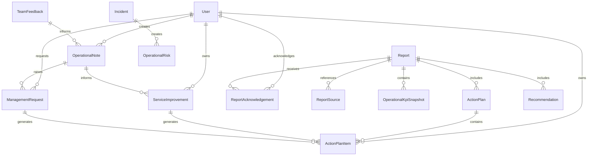

# Database Impact Analysis v2

## Purpose

This document reviews the current Prisma schema and identifies recommended database changes required to support the revised product direction:

RIBBAI OPS is an Operations Management and Intelligence Platform for Front of House operations. Inventory is one data source, not the core product.

No schema changes are applied in this document.

## Current Schema Coverage

The current schema already includes useful foundations:

- `User`, `Role`, `Session`, `Account`
- `Employee`
- `Shift`
- `Attendance`
- `Supplier`
- `InventoryItem`
- `InventoryTransaction`
- `WeeklyInventory`
- `WeeklyInventoryItem`
- `Report`
- `ChecklistTemplate`
- `Checklist`
- `Incident`
- `Document`
- `Notification`
- `AuditLog`
- `PerformanceMetric`
- `AIForecast`
- `AIInsight`
- `Setting`
- `SystemMetadata`

## Current Gaps

The current schema lacks first-class models for the new Operations Intelligence Layer:

- Operational notes
- Service improvements
- Management requests
- Action plans
- Team feedback
- Weekly operations report snapshots
- Monthly operations report snapshots
- Report acknowledgements
- Report section source mapping
- KPI snapshots
- Risk register
- Recommendation tracking

The existing generic `Report` model can store generated report content, but it is not enough by itself for operational intelligence. The platform needs structured source data before report composition.

## Recommended New Models

## 1. OperationalNote

### Purpose

Capture Filipe's operational observations, challenges, achievements, management requests, and reportable narrative context.

### Recommended Fields

- `id`
- `title`
- `noteType`
- `content`
- `periodDate`
- `servicePeriod`
- `category`
- `severity`
- `impactTypes`
- `visibility`
- `status`
- `createdById`
- `reviewedById`
- `reviewedAt`
- `includedInReportId`
- `linkedIncidentId`
- `linkedServiceImprovementId`
- `linkedManagementRequestId`
- `metadata`
- `deletedAt`
- `createdAt`
- `updatedAt`

### Relationships

- belongs to `User` as creator
- optionally links to `Incident`
- optionally links to `ServiceImprovement`
- optionally links to `ManagementRequest`
- optionally links to `Report`

### Indexes

- `noteType`
- `periodDate`
- `category`
- `severity`
- `status`
- `createdById`

## 2. ServiceImprovement

### Purpose

Track continuous operational improvements from problem to measured result.

### Recommended Fields

- `id`
- `title`
- `improvementType`
- `problem`
- `proposedSolution`
- `expectedImpact`
- `measuredImpact`
- `resultSummary`
- `impactRating`
- `status`
- `priority`
- `ownerId`
- `createdById`
- `reviewedById`
- `sourceType`
- `sourceId`
- `targetDate`
- `startedAt`
- `implementedAt`
- `completedAt`
- `deletedAt`
- `createdAt`
- `updatedAt`

### Relationships

- belongs to `User` as creator
- belongs to `User` or `Employee` as owner
- has many `ActionPlanItem`
- optionally links to `OperationalNote`
- optionally links to `Incident`
- optionally links to `ManagementRequest`

### Indexes

- `improvementType`
- `status`
- `priority`
- `ownerId`
- `createdById`
- `targetDate`

## 3. ManagementRequest

### Purpose

Track requests requiring management or administration attention.

### Recommended Fields

- `id`
- `title`
- `reason`
- `decisionNeeded`
- `requestedById`
- `requestedToIds`
- `priority`
- `status`
- `dueDate`
- `acknowledgedAt`
- `resolvedAt`
- `resolutionNote`
- `sourceType`
- `sourceId`
- `includedInReportId`
- `deletedAt`
- `createdAt`
- `updatedAt`

### Relationships

- belongs to `User` as requester
- many-to-many with `User` as requested recipients
- optionally links to `OperationalNote`
- optionally links to `ServiceImprovement`
- optionally links to `ActionPlanItem`
- optionally links to `Report`

### Indexes

- `status`
- `priority`
- `dueDate`
- `requestedById`

## 4. ActionPlan

### Purpose

Represent a report-level or period-level action plan.

### Recommended Fields

- `id`
- `title`
- `periodType`
- `periodStart`
- `periodEnd`
- `status`
- `createdById`
- `approvedById`
- `approvedAt`
- `reportId`
- `deletedAt`
- `createdAt`
- `updatedAt`

### Relationships

- belongs to `Report`
- has many `ActionPlanItem`
- belongs to `User` as creator
- optionally belongs to `User` as approver

### Indexes

- `periodType`
- `periodStart`
- `periodEnd`
- `status`

## 5. ActionPlanItem

### Purpose

Track individual accountable actions.

### Recommended Fields

- `id`
- `actionPlanId`
- `title`
- `description`
- `ownerId`
- `priority`
- `status`
- `dueDate`
- `completedAt`
- `expectedOutcome`
- `result`
- `sourceType`
- `sourceId`
- `blockedReason`
- `deletedAt`
- `createdAt`
- `updatedAt`

### Relationships

- belongs to `ActionPlan`
- belongs to `User` or `Employee` as owner
- optionally links to `ServiceImprovement`
- optionally links to `ManagementRequest`
- optionally links to `Incident`
- optionally links to `OperationalNote`

### Indexes

- `actionPlanId`
- `ownerId`
- `status`
- `priority`
- `dueDate`

## 6. TeamFeedback

### Purpose

Capture team sentiment, ideas, concerns, achievements, and training needs.

### Recommended Fields

- `id`
- `feedbackType`
- `category`
- `content`
- `sentiment`
- `isAnonymous`
- `submittedById`
- `periodDate`
- `servicePeriod`
- `visibility`
- `status`
- `linkedOperationalNoteId`
- `linkedServiceImprovementId`
- `deletedAt`
- `createdAt`
- `updatedAt`

### Relationships

- optionally belongs to `User` or `Employee` as submitter
- optionally links to `OperationalNote`
- optionally links to `ServiceImprovement`

### Indexes

- `feedbackType`
- `category`
- `sentiment`
- `periodDate`
- `status`

## 7. OperationalKpiSnapshot

### Purpose

Store calculated KPIs for weekly and monthly reporting snapshots.

### Recommended Fields

- `id`
- `periodType`
- `periodStart`
- `periodEnd`
- `kpiKey`
- `kpiLabel`
- `value`
- `unit`
- `target`
- `previousValue`
- `status`
- `calculationVersion`
- `sourceRefs`
- `reportId`
- `createdAt`

### Relationships

- optionally belongs to `Report`

### Indexes

- `periodType`
- `periodStart`
- `periodEnd`
- `kpiKey`
- `reportId`

## 8. OperationalRisk

### Purpose

Track operational risks across weekly and monthly periods.

### Recommended Fields

- `id`
- `title`
- `description`
- `category`
- `likelihood`
- `impact`
- `riskScore`
- `mitigation`
- `ownerId`
- `status`
- `sourceType`
- `sourceId`
- `periodStart`
- `periodEnd`
- `resolvedAt`
- `deletedAt`
- `createdAt`
- `updatedAt`

### Relationships

- belongs to owner as `User` or `Employee`
- optionally links to `Report`
- optionally links to `OperationalNote`, `Incident`, or `ServiceImprovement`

### Indexes

- `category`
- `status`
- `riskScore`
- `periodStart`
- `ownerId`

## 9. ReportAcknowledgement

### Purpose

Track that Luís, Paulo, and Francisco have received, reviewed, or acknowledged reports.

### Recommended Fields

- `id`
- `reportId`
- `userId`
- `acknowledgementType`
- `status`
- `comment`
- `acknowledgedAt`
- `createdAt`

### Relationships

- belongs to `Report`
- belongs to `User`

### Indexes

- `reportId`
- `userId`
- `status`

## 10. ReportSource

### Purpose

Trace report sections back to source data.

### Recommended Fields

- `id`
- `reportId`
- `sectionKey`
- `sourceType`
- `sourceId`
- `includedAt`

### Relationships

- belongs to `Report`

### Indexes

- `reportId`
- `sectionKey`
- `sourceType`
- `sourceId`

## 11. Recommendation

### Purpose

Track executive recommendations from monthly reports and future AI outputs.

### Recommended Fields

- `id`
- `title`
- `description`
- `evidence`
- `expectedImpact`
- `priority`
- `status`
- `sourceType`
- `sourceId`
- `reportId`
- `ownerId`
- `decisionRequired`
- `acceptedAt`
- `rejectedAt`
- `completedAt`
- `createdAt`
- `updatedAt`

### Relationships

- optionally belongs to `Report`
- optionally belongs to `User` as owner
- optionally links to `ActionPlanItem`

### Indexes

- `priority`
- `status`
- `reportId`
- `ownerId`

## Recommended Changes to Existing Models

## Report

Current model is generic and useful. Recommended additions:

- `reportNumber`
- `submittedTo` as structured recipient relation or JSON
- `periodLabel`
- `snapshotVersion`
- `reviewStatus`
- `acknowledgedAt`
- `acknowledgedBy`
- `sourceCompleteness`
- `riskSummary`
- relation to `ReportAcknowledgement`
- relation to `ReportSource`
- relation to `OperationalKpiSnapshot`
- relation to `ActionPlan`
- relation to `Recommendation`

## Incident

Recommended additions:

- link to `OperationalRisk`
- link to `ActionPlanItem`
- link to `ServiceImprovement`
- `serviceImpact`
- `guestImpact`
- `operationalCategory`

## Checklist

Recommended additions:

- `servicePeriod`
- `operationalArea`
- `missedReason`
- link to `OperationalNote`
- link to `ActionPlanItem`

## Attendance

Recommended additions:

- `latenessMinutes`
- `earlyLeaveMinutes`
- `absenceReason`
- `attendanceExceptionType`
- `reviewNote`

## Shift

Recommended additions:

- `servicePeriod`
- `roleRequired`
- `coverageRisk`
- `coverageNotes`

## WeeklyInventory

Recommended additions:

- `scheduledInventoryDate`
- `completedOnExpectedDay`
- `serviceImpactNotes`
- `processIssues`
- link to weekly operations report

## PerformanceMetric

Current model is employee-focused. Recommended expansion:

- Either keep for employee performance only and add `OperationalKpiSnapshot`, or broaden it carefully.
- Prefer adding `OperationalKpiSnapshot` to avoid mixing employee metrics with report KPIs.

## Suggested Enums

Current schema uses strings for statuses and categories. For operational intelligence, enums would improve data quality.

Recommended enums:

- `ReportType`
- `ReportStatus`
- `OperationalNoteType`
- `OperationalCategory`
- `ImpactType`
- `Severity`
- `Priority`
- `ActionStatus`
- `ImprovementStatus`
- `ImprovementType`
- `ManagementRequestStatus`
- `FeedbackType`
- `Sentiment`
- `RiskStatus`
- `AcknowledgementStatus`

## Reporting Data Model Pattern

Use two layers:

1. Source records: notes, improvements, feedback, incidents, attendance, shifts, checklists, inventory.
2. Report snapshots: frozen summary, metrics, sections, source references, acknowledgements.

This prevents reports from changing retroactively when source records are edited later.

## Relationship Diagram

## Migration Priority

Recommended schema implementation order:

1. Add enums and shared status definitions.
2. Add `OperationalNote`.
3. Add `ManagementRequest`.
4. Add `ServiceImprovement`.
5. Add `ActionPlan` and `ActionPlanItem`.
6. Add `TeamFeedback`.
7. Add `OperationalRisk`.
8. Add `OperationalKpiSnapshot`.
9. Add `ReportAcknowledgement`.
10. Add `ReportSource`.
11. Add `Recommendation`.
12. Add targeted fields to existing models.

## Key Design Decision

Do not solve this by storing more JSON inside `Report`.

The platform needs structured operational capture first. Reports should be outputs generated from structured data, not the primary place where operational intelligence lives.
