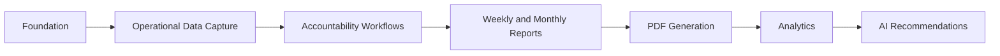

# Implementation Roadmap v2

## Purpose

This roadmap updates the implementation order for the revised product direction:

RIBBAI OPS is an Operations Management and Intelligence Platform for RIBBAI Front of House operations.

Inventory remains part of the system, but it is not the product center.

## Core Implementation Principle

Prioritize data capture first, then reporting, then PDF generation, then analytics, then AI recommendations.

Why:

- Reports are only useful if the source data is reliable.
- PDFs are only valuable once report content is structured.
- Analytics requires consistent historical data.
- AI recommendations require clean, repeated, source-linked patterns.

## Roadmap Overview

## Phase 1: Foundation Validation

### Goal

Maintain the already completed infrastructure foundation.

### Scope

- Environment validation
- Prisma client
- Auth.js foundation
- Supabase foundation
- Logging and error handling
- Audit logging foundation
- Repository/service base patterns
- Test setup
- Build validation

### Status

Completed.

## Phase 2: Authentication and Roles

### Goal

Enable secure access for Filipe, Luís, Paulo, Francisco, and future staff users.

### Why Now

All operational data will be role-sensitive. The system must know who created notes, who submitted reports, who acknowledged requests, and who owns actions.

### Deliverables

- Auth providers or credentials strategy
- Login/logout flows
- Role definitions:
  - Administrator
  - Manager
  - Head Waiter
  - Staff
  - Read-only reviewer
- Permission evaluation
- Route protection
- Auth audit events

### Success Criteria

- Filipe, Luís, Paulo, and Francisco can be represented with correct roles.
- Protected routes require authentication.
- Access can be differentiated by role.

## Phase 3: Core People and Shift Data

### Goal

Capture the operational people and schedule data needed for reporting.

### Why Before Reports

Team performance, attendance, overtime, and accountability depend on employee and shift data.

### Deliverables

- Employee profiles
- Shift records
- Attendance records
- Overtime calculation rules
- Basic exceptions: absence, lateness, early leave

### Success Criteria

- Scheduled hours can be calculated.
- Worked hours can be calculated.
- Overtime can be derived.
- Attendance and punctuality KPIs can be generated.

## Phase 4: Operational Notes

### Goal

Give Filipe a structured way to capture operational observations, weekly challenges, team achievements, and management requests.

### Why Before Reporting

Operational reports need context. Metrics alone cannot explain service quality, communication, challenges, or management needs.

### Deliverables

- Operational notes model
- Note creation and classification
- Note status lifecycle
- Report visibility flag
- Links to incidents, improvements, requests, and reports

### Success Criteria

- Filipe can capture reportable observations.
- Notes can be categorized and reviewed.
- Notes can be selected as report source material.

## Phase 5: Team Feedback

### Goal

Capture team sentiment, suggestions, concerns, achievements, and training needs.

### Why Here

Team feedback strengthens the intelligence layer and helps explain operational patterns before formal reports are generated.

### Deliverables

- Team feedback model
- Feedback categories
- Optional anonymity
- Feedback review workflow
- Links to notes and improvements

### Success Criteria

- Feedback can be grouped into themes.
- Feedback can feed weekly and monthly reports.
- Training needs can be surfaced.

## Phase 6: Service Improvements

### Goal

Implement the continuous improvement workflow.

### Why Before Reports

Weekly and monthly reports must show not only problems, but solutions and measurable progress.

### Deliverables

- Service improvement model
- Problem/solution/owner/status/result tracking
- Impact measurement fields
- Link to notes, incidents, feedback, and action plans

### Success Criteria

- Improvements can move from proposed to completed.
- Owners and statuses are visible.
- Measured impact can be recorded.

## Phase 7: Management Requests and Action Plans

### Goal

Make management decisions and next steps explicit, trackable, and reportable.

### Why Before Reports

Reports should create accountability. Requests and action plans must exist as structured data before they are rendered.

### Deliverables

- Management request model
- Request recipient tracking
- Acknowledgement and resolution status
- Action plan model
- Action plan item model
- Owner, due date, priority, status

### Success Criteria

- Open management requests are visible.
- Every major report finding can become an action item.
- Carryover and overdue actions can be tracked.

## Phase 8: Checklists and Incidents Integration

### Goal

Connect existing checklist and incident domains into operational intelligence.

### Why Here

Checklists and incidents are strong signals for standards, risk, and operational consistency.

### Deliverables

- Checklist completion intelligence
- Missed checklist reason capture
- Incident operational category fields
- Incident-to-risk and incident-to-action links

### Success Criteria

- Checklist compliance can feed service performance.
- Incidents can feed risk and corrective action sections.

## Phase 9: Inventory as Operational Signal

### Goal

Integrate inventory and weekly inventory as supporting operational context.

### Why Not Earlier

Inventory is important, but not the center of RIBBAI OPS. It should feed reports when it affects service, cost, process, or risk.

### Deliverables

- Weekly inventory completion tracking
- Tuesday inventory schedule validation
- Variance summaries
- Service-impacting stock issue capture
- Process issue notes

### Success Criteria

- Weekly inventory appears as a concise report section.
- Inventory issues can be linked to operational notes, risks, or management requests.

## Phase 10: KPI Snapshot Engine

### Goal

Calculate and freeze weekly/monthly operational KPIs.

### Why Before Reports

Reports should use consistent, auditable KPI snapshots, not live calculations that change after submission.

### Deliverables

- Operational KPI definitions
- KPI calculation service
- KPI snapshot model
- Source reference tracking
- Calculation versioning

### Success Criteria

- Weekly KPIs can be snapshotted.
- Monthly KPIs can aggregate approved weekly snapshots.
- KPI values can be traced back to source data.

## Phase 11: Weekly Operations Report

### Goal

Build the Weekly Operations Report as the main management accountability artifact.

### Why Now

By this stage, the system has the needed source data: attendance, notes, feedback, improvements, requests, action plans, incidents, checklist data, and inventory context.

### Deliverables

- Weekly report composer
- Weekly report section builders
- Report source mapping
- Report snapshot/versioning
- Submission workflow
- Management acknowledgements

### Success Criteria

- Weekly reports can be generated from structured data.
- Reports include executive summary, team performance, service performance, challenges, improvements, incidents, inventory context, risks, requests, and action plan.
- Reports remain stable after submission.

## Phase 12: Monthly Operations Report

### Goal

Build the executive monthly report focused on trends, costs, risks, and operational excellence.

### Why After Weekly Reports

Monthly reports should aggregate approved weekly snapshots. Building monthly reporting first would encourage manual summaries and weak data lineage.

### Deliverables

- Monthly aggregation service
- Trend analysis
- Cost analysis
- KPI evolution
- Recommendations
- Management actions

### Success Criteria

- Monthly reports show trends and executive recommendations.
- Monthly reports can identify unresolved risks and recurring challenges.
- Francisco receives administration-grade visibility.

## Phase 13: PDF Generation

### Goal

Render weekly and monthly reports as professional executive PDFs.

### Why After Report Composition

PDF generation should render approved structured content. It should not be responsible for deciding report meaning.

### Deliverables

- PDF templates
- Shared PDF components
- Cover page
- KPI cards
- Charts
- Tables
- Recommendation blocks
- Action plans
- Signature sections
- Supabase PDF storage

### Success Criteria

- Weekly report PDFs render consistently.
- Monthly report PDFs render consistently.
- Generated PDFs are stored and linked to reports.

## Phase 14: Operational Dashboards

### Goal

Provide live visibility into operational status.

### Why After Reports

Dashboards should reflect validated operational data and report KPIs, not introduce a separate interpretation layer.

### Deliverables

- Operations overview
- Open actions
- Management requests
- Current risks
- Attendance and overtime summary
- Improvement status
- Report status

### Success Criteria

- Filipe can manage weekly readiness.
- Luís and Paulo can see operational status.
- Francisco can see executive indicators when appropriate.

## Phase 15: Analytics

### Goal

Analyze historical patterns across weeks and months.

### Why After Capture and Reporting

Analytics requires accumulated, clean, consistent data.

### Deliverables

- Trend dashboards
- KPI history
- Recurring issue detection
- Cost pressure analysis
- Service improvement impact analysis
- Risk history

### Success Criteria

- Management can see operational direction over time.
- Recurring problems are visible.
- Improvements can be evaluated by impact.

## Phase 16: AI Recommendations

### Goal

Use operational history to suggest risks, improvements, training needs, and management actions.

### Why Last

AI requires clean data, historical patterns, and human-approved workflows. Adding AI too early would produce weak recommendations.

### Deliverables

- AI insight generation
- Risk prediction
- Recommendation suggestions
- Training suggestions
- Staffing pressure signals
- Human approval workflow

### Success Criteria

- AI recommendations are source-linked.
- AI outputs never mutate operational data without approval.
- Recommendations improve management decision quality.

## Implementation Priority Summary

| Priority | Workstream | Reason |
| --- | --- | --- |
| 1 | Authentication and roles | Required for accountability and permissions |
| 2 | People, shifts, attendance | Required for team performance and overtime |
| 3 | Operational notes and feedback | Required for human operational context |
| 4 | Improvements, requests, actions | Required for accountability and continuous improvement |
| 5 | Checklist, incident, inventory signals | Required for operational evidence |
| 6 | KPI snapshots | Required for trustworthy reporting |
| 7 | Weekly reports | Primary management accountability artifact |
| 8 | Monthly reports | Executive trend and decision artifact |
| 9 | PDF generation | Professional management delivery |
| 10 | Dashboards and analytics | Visibility and historical insight |
| 11 | AI recommendations | Advanced intelligence after data maturity |

## Key Warning

Do not start with PDFs, analytics, or AI.

Those outputs will only be trusted if the platform first captures high-quality operational data and preserves reportable source evidence.
