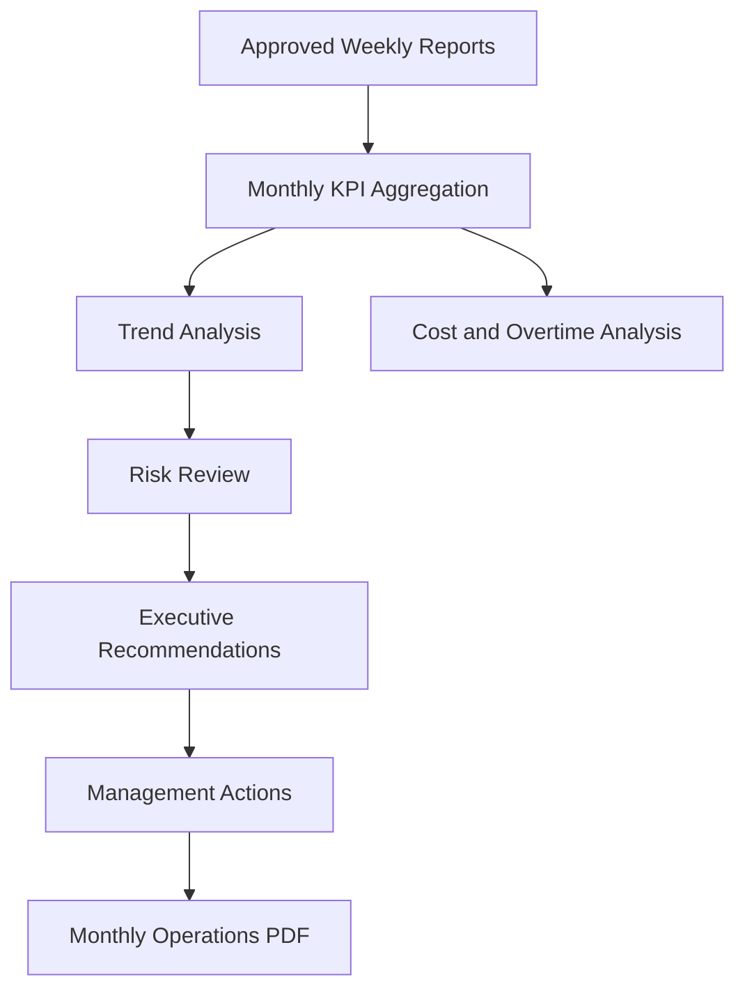
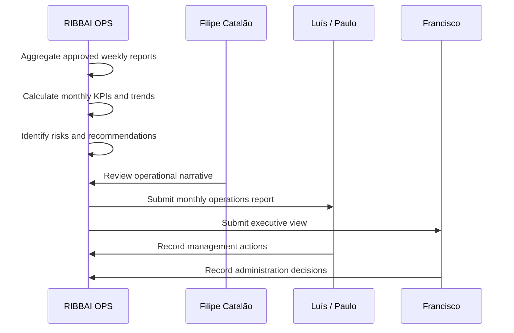

# Monthly Operations Report Specification

## Purpose

The Monthly Operations Report is the executive-grade operating review for RIBBAI Front of House. It aggregates approved weekly operational records into trends, risks, costs, and recommendations for Luís, Paulo, and Francisco.

The monthly report should answer:

- Is the Front of House operation improving?
- Where are costs or risks increasing?
- Which service improvements worked?
- What decisions does management need to make?
- What should the operation focus on next month?

## Audience

- Luís
- Paulo
- Francisco

## Ownership and Cadence

- Prepared from approved weekly reports and monthly operational snapshots.
- Submitted monthly to management and administration.
- Should include management action items and executive recommendations.

## Monthly Report Principles

- Trends over events.
- Executive interpretation over raw data.
- Cost and risk visibility.
- Operational excellence focus.
- Recommendations tied to evidence.
- Inventory treated as one operational trend, not as the center of the report.

## Required Report Metadata

| Field | Type | Required | Description |
| --- | --- | --- | --- |
| reportId | string | Yes | Unique report identifier |
| reportType | enum | Yes | `MONTHLY_OPERATIONS` |
| restaurant | string | Yes | RIBBAI |
| month | number | Yes | Calendar month |
| year | number | Yes | Calendar year |
| periodStart | date | Yes | First day of reporting period |
| periodEnd | date | Yes | Last day of reporting period |
| preparedBy | user reference | Yes | Report preparer |
| submittedTo | user list | Yes | Luís, Paulo, Francisco |
| sourceWeeklyReports | id list | Yes | Weekly reports included |
| status | enum | Yes | Draft, submitted, acknowledged, revised |
| submittedAt | datetime | No | Submission timestamp |

## Data Sources

- Approved weekly operations reports
- Shifts
- Attendance records
- Overtime calculations
- Operational notes
- Service improvements
- Management requests
- Action plans
- Incidents
- Checklists
- Team feedback
- Inventory and weekly inventory summaries
- Audit logs for report lifecycle

## Report Structure

## Section 1: Executive Summary

### Purpose

Provide a boardroom-style overview of the month.

### Data Sources

- Weekly report executive summaries
- Monthly KPI engine
- Risk register
- Action plan outcomes
- Management requests

### Required Fields

- Monthly operating status
- Key achievements
- Key concerns
- Cost pressure summary
- Risk summary
- Management decisions required
- Next month priorities

### Display Format

- One-page executive opening.
- KPI scorecard.
- Three narrative blocks: Performance, Risk, Decisions.

### KPI Calculations

- Monthly operations score = weighted monthly average of attendance, service performance, checklist compliance, incident severity, action completion, and management request closure.
- Month-over-month score change = current operations score - previous month operations score.
- Executive risk score = sum of open high-risk items weighted by likelihood and impact.

## Section 2: Attendance Trends

### Purpose

Show reliability, staffing consistency, and attendance direction over the month.

### Data Sources

- Attendance
- Shifts
- Weekly reports

### Required Fields

- Scheduled shifts
- Completed shifts
- Absences
- Late arrivals
- Attendance percentage
- Punctuality percentage
- Week-by-week comparison

### Display Format

- Line chart for attendance rate by week.
- Bar chart for absence and lateness counts.
- Exception summary table.

### KPI Calculations

- Monthly attendance rate = attended shifts / scheduled shifts x 100.
- Monthly punctuality rate = on-time clock-ins / expected clock-ins x 100.
- Absence trend = current month absence count - previous month absence count.
- Reliability score = weighted attendance and punctuality score.

## Section 3: Overtime Analysis

### Purpose

Identify cost pressure and staffing imbalance.

### Data Sources

- Shifts
- Attendance
- Employee cost fields where available
- Operational notes

### Required Fields

- Scheduled hours
- Worked hours
- Overtime hours
- Estimated overtime cost
- Overtime by week
- Overtime by employee or role
- Root-cause notes

### Display Format

- KPI cards for overtime hours, overtime percentage, estimated overtime cost.
- Week-by-week overtime trend.
- Root cause narrative.

### KPI Calculations

- Overtime hours = max(worked hours - scheduled hours, 0).
- Overtime percentage = overtime hours / scheduled hours x 100.
- Estimated overtime cost = overtime hours x hourly rate x overtime multiplier.
- Overtime concentration = top 20% of employees' overtime / total overtime.

## Section 4: Service Improvements

### Purpose

Evaluate the continuous improvement discipline of the FOH operation.

### Data Sources

- Service improvement module
- Weekly report improvement sections
- Operational notes
- Team feedback

### Required Fields

- Improvements opened
- Improvements completed
- Improvements still active
- Measured impact
- Owner
- Category
- Related problem

### Display Format

- Improvement funnel: proposed, approved, in progress, completed.
- Completed improvements table.
- Impact highlights.

### KPI Calculations

- Improvement completion rate = completed improvements / opened improvements.
- Average implementation time = completed date - created date.
- Impact measurement coverage = completed improvements with measured impact / completed improvements.
- Repeat problem reduction = repeat issues before and after improvement.

## Section 5: Operational Challenges

### Purpose

Identify recurring problems and operational bottlenecks.

### Data Sources

- Weekly report challenges
- Operational notes
- Incidents
- Team feedback
- Checklists

### Required Fields

- Challenge category
- Frequency
- Severity
- First observed date
- Weeks repeated
- Impact
- Current status

### Display Format

- Top recurring challenges.
- Heatmap by category and week.
- Narrative explanation of root causes.

### KPI Calculations

- Recurrence rate = repeated challenges / total challenges.
- High-severity challenge count.
- Average challenge age = current date - first observed date.
- Resolution rate = resolved challenges / total challenges.

## Section 6: Inventory Trends

### Purpose

Provide operational context from inventory activity, especially where stock, variance, or process issues affected service.

### Data Sources

- Weekly inventory
- Weekly inventory items
- Inventory transactions
- Operational notes

### Required Fields

- Weekly inventory completion status
- Major variance categories
- Service-impacting stock issues
- Wastage notes
- Process issues
- Trend from prior month

### Display Format

- Exception-focused summary.
- Trend chart for variance value.
- Short operational impact narrative.

### KPI Calculations

- Monthly variance value = sum of weekly variance values.
- Average weekly variance = monthly variance value / number of weekly counts.
- Service-impacting inventory issue count.
- Weekly inventory completion rate = completed weekly counts / expected Tuesday counts.

## Section 7: Cost Analysis

### Purpose

Summarize controllable operational cost pressure.

### Data Sources

- Overtime calculations
- Employee cost fields
- Inventory variance values
- Incidents with financial impact
- Operational notes

### Required Fields

- Estimated overtime cost
- Inventory variance cost
- Incident financial impact
- Cost drivers
- Management attention items

### Display Format

- Cost summary cards.
- Cost driver table.
- Recommendation block for cost control.

### KPI Calculations

- Total operational cost pressure = overtime cost + inventory variance cost + incident financial impact.
- Overtime cost share = overtime cost / total operational cost pressure.
- Cost trend = current month cost pressure - previous month cost pressure.

## Section 8: KPI Evolution

### Purpose

Show whether the operation is improving over time.

### Data Sources

- Weekly KPIs
- Monthly aggregates
- Service ratings
- Checklists
- Incidents
- Action plan outcomes

### Required Fields

- KPI name
- Current month value
- Previous month value
- Direction
- Target
- Status
- Commentary

### Display Format

- Executive KPI table.
- Sparkline or trend arrow per KPI.
- Status color: excellent, stable, watch, at risk.

### Core KPIs

- Attendance rate
- Punctuality rate
- Overtime percentage
- Service quality score
- Team coordination score
- Communication score
- Checklist compliance rate
- Incident rate
- Improvement completion rate
- Action plan completion rate
- Management request closure rate

## Section 9: Recommendations

### Purpose

Translate monthly analysis into management-grade recommendations.

### Data Sources

- Monthly KPI evolution
- Risks
- Operational challenges
- Service improvements
- Team feedback
- Management requests

### Required Fields

- Recommendation title
- Evidence
- Expected impact
- Required decision
- Owner
- Suggested deadline
- Priority

### Display Format

- Recommendation blocks.
- Evidence summary.
- Decision required marker.

### KPI Calculations

- Recommendation priority score = impact score x urgency score x evidence confidence.
- Recommendation acceptance rate, tracked after management review.

## Section 10: Management Actions

### Purpose

Hold management decisions and administrative follow-up in one place.

### Data Sources

- Management requests
- Action plans
- Recommendations
- Report acknowledgements

### Required Fields

- Action
- Assigned to
- Requested by
- Source report
- Due date
- Status
- Decision notes

### Display Format

- Management action table.
- Separate overdue or blocked section.
- Sign-off section for Luís, Paulo, and Francisco.

### KPI Calculations

- Management action closure rate = closed management actions / total management actions.
- Average acknowledgement time = acknowledged date - submitted date.
- Overdue management action count.

## Monthly Report Snapshot Rules

- Monthly report should be generated from approved weekly report snapshots.
- If a weekly report is missing, the monthly report must flag the gap.
- KPI calculations should preserve the underlying source IDs.
- Executive recommendations should require human review before final submission.
- Management acknowledgement should be stored separately from report content.

## Monthly Report Output Flow

## Success Criteria

- Management can understand operational direction in under five minutes.
- Every trend has source evidence.
- Every recommendation has a clear management action.
- Inventory is included only when operationally meaningful.
- The report becomes a trusted monthly operating review for RIBBAI.
