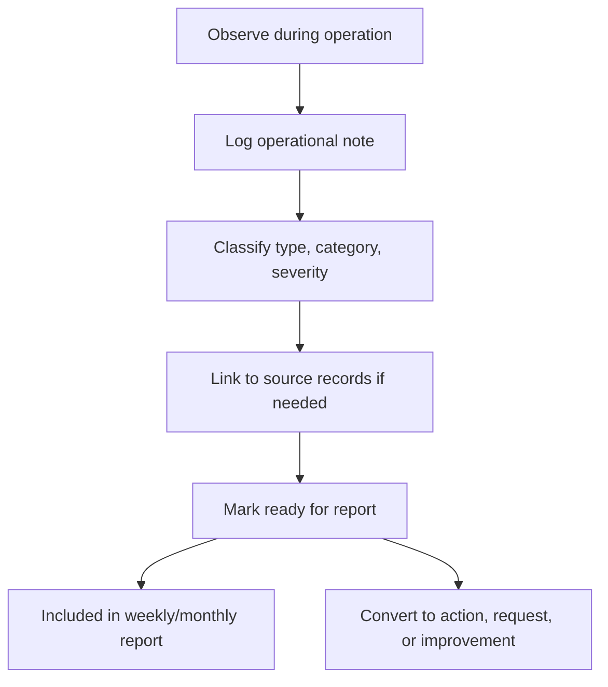

# Operational Notes Module

## Purpose

The Operational Notes module gives Filipe Catalão a structured way to capture the reality of Front of House operations at RIBBAI.

This module is one of the main data sources for weekly and monthly reports. It captures context that pure metrics cannot explain: service observations, weekly challenges, team achievements, management requests, and improvement opportunities.

## Primary User

- Filipe Catalão, Head Waiter

## Secondary Users

- Luís
- Paulo
- Francisco, for executive or administrative visibility when relevant

## Module Objectives

- Capture operational context during or after service.
- Preserve weekly management narrative in a structured way.
- Convert observations into report sections.
- Identify recurring issues and improvement opportunities.
- Support accountability without overloading daily operations.

## Note Types

| Type | Purpose | Report Usage |
| --- | --- | --- |
| Operational observation | Record what happened during service | Service performance, executive summary |
| Service improvement | Identify a possible improvement | Service improvements, action plan |
| Weekly challenge | Capture a difficulty affecting the week | Operational challenges, risks |
| Team achievement | Recognize positive performance | Executive summary, team feedback |
| Management request | Ask for decision, support, or approval | Management requests |
| Risk note | Flag potential future issue | Risks for next week |
| Training need | Capture skill or knowledge gap | Action plan, monthly recommendations |
| Inventory context | Note stock/process issue affecting operations | Inventory summary only |

## Core Data Structure

```ts
type OperationalNote = {
  id: string;
  title: string;
  noteType: OperationalNoteType;
  content: string;
  periodDate: string;
  servicePeriod?: "lunch" | "dinner" | "full_day" | "other";
  category: OperationalCategory;
  severity?: "low" | "medium" | "high" | "critical";
  impactType: ImpactType[];
  visibility: "private_draft" | "reportable" | "management_only";
  linkedEmployeeIds?: string[];
  linkedIncidentId?: string;
  linkedImprovementId?: string;
  linkedManagementRequestId?: string;
  createdBy: string;
  reviewedBy?: string;
  status: "draft" | "ready_for_report" | "included_in_report" | "archived";
  createdAt: string;
  updatedAt: string;
};
```

## Operational Categories

- Service quality
- Team coordination
- Communication
- Guest flow
- Table pacing
- Staffing
- Training
- Checklists
- Incident context
- Inventory context
- Management
- Other

## Impact Types

- Guest experience
- Service speed
- Service consistency
- Team morale
- Cost
- Risk
- Compliance
- Training
- Management decision

## Capture Workflow



## Note Lifecycle

| Status | Meaning |
| --- | --- |
| Draft | Captured but not ready for reporting |
| Ready for report | Reviewed and can appear in report data |
| Included in report | Used in a submitted report |
| Archived | Retained but no longer active |

## Required Fields by Note Type

### Operational Observation

- Title
- Date
- Service period
- Category
- Content
- Operational impact
- Report visibility

### Service Improvement Note

- Problem observed
- Proposed improvement
- Expected impact
- Suggested owner
- Suggested priority

### Weekly Challenge

- Challenge description
- Severity
- Impact
- Root cause if known
- Proposed mitigation

### Team Achievement

- Achievement description
- Team or individual involved
- Operational value
- Whether it should appear in the weekly report

### Management Request

- Request title
- Requested decision/support
- Requested to: Luís, Paulo, Francisco, or group
- Priority
- Due date if applicable
- Reason

## Report Integration

Operational notes should feed reports as follows:

| Report Section | Note Sources |
| --- | --- |
| Executive Summary | Achievements, high-impact observations, management requests |
| Service Performance | Service quality, coordination, communication, efficiency notes |
| Operational Challenges | Weekly challenges and risk notes |
| Solutions Implemented | Notes linked to completed improvements |
| Service Improvements | Improvement notes and linked workflows |
| Team Feedback | Team-related observations and feedback notes |
| Risks For Next Week | Risk notes, unresolved challenges |
| Management Requests | Management request notes |

## Weekly Review Flow

Every reporting week, Filipe should review notes and decide:

- Which notes are reportable.
- Which notes require action.
- Which notes should become service improvements.
- Which notes require management requests.
- Which notes should remain private drafts.

## Monthly Intelligence Flow

At month end, the system should group notes by:

- Category
- Severity
- Impact type
- Repetition
- Linked actions
- Linked improvements
- Management outcomes

This enables trend analysis such as:

- Recurring communication issues.
- Repeated service bottlenecks.
- Most common team feedback themes.
- Improvements with measurable impact.
- Challenges that management did not resolve.

## Permissions

Recommended access:

- Filipe: create, edit, classify, mark ready for report.
- Luís and Paulo: view reportable notes, comment, request follow-up.
- Francisco: view notes included in monthly reports or administrative escalations.
- Staff: optional future feedback-only input, not full notes access.

## Quality Rules

- Notes should be factual, specific, and professional.
- Avoid using notes for personal criticism.
- Link notes to incidents when risk or disruption occurred.
- Link notes to service improvements when a solution is proposed.
- Keep private drafts out of generated reports.
- Preserve the original note once included in a submitted report.

## Future AI Use

Operational notes will become valuable AI input for:

- Theme detection
- Sentiment trends
- Recurring problem detection
- Suggested action plans
- Training recommendations
- Risk prediction

AI must never publish note content into a report without human review.
