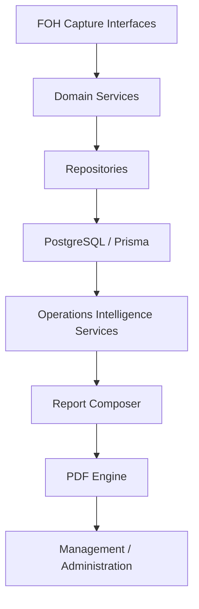
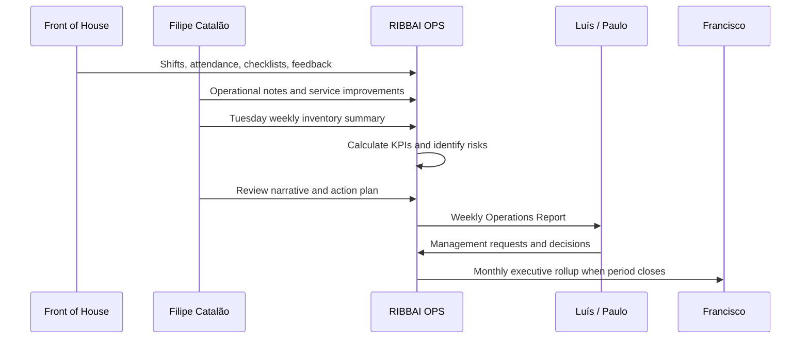

# Operations Intelligence Architecture

## Purpose

RIBBAI OPS is an Operations Management and Intelligence Platform for the Front of House operation at RIBBAI. It is not an inventory management system. Inventory is one operational data source among many.

The Operations Intelligence Layer exists to convert daily Front of House activity into visibility, accountability, continuous improvement, and executive reporting for Filipe Catalão, Luís, Paulo, and Francisco.

## Business Context

- Restaurant: RIBBAI
- Head Waiter: Filipe Catalão
- Managers: Luís and Paulo
- Administrator: Francisco
- Weekly inventory day: Tuesday
- Weekly reports: submitted to management
- Monthly reports: submitted to management and administration

## Intelligence Layer Objectives

- Provide a single operational truth for Front of House performance.
- Make team effort, attendance, overtime, and accountability visible.
- Track service quality, service improvements, and operational challenges.
- Separate facts, observations, recommendations, and management decisions.
- Turn weekly activity into structured reports.
- Turn monthly history into trends, risks, and executive recommendations.
- Prepare clean operational datasets for future AI recommendations.

## Operational Data Sources

The intelligence layer receives data from structured system events and human operational judgment.

| Source | Nature | Primary Owner | Intelligence Value |
| --- | --- | --- | --- |
| Shifts | Structured schedule data | Managers / Head Waiter | Planned staffing, scheduled hours, coverage |
| Attendance | Structured time data | Team / Head Waiter | Worked hours, absence, lateness, reliability |
| Overtime | Derived metric | System | Cost pressure, staffing gaps, workload balance |
| Inventory | Structured operational stock data | Operations | Availability, wastage, operational constraints |
| Weekly Inventory | Structured Tuesday process | Filipe / team | Weekly control, variance, process discipline |
| Checklists | Structured task completion | FOH team | Operational consistency and standards |
| Incidents | Structured exceptions | Head Waiter / Managers | Risk, service disruption, corrective actions |
| Service Improvements | Structured improvement workflow | Filipe / Managers | Continuous improvement, measurable impact |
| Operational Notes | Semi-structured observations | Filipe | Context, explanations, qualitative intelligence |
| Management Requests | Structured requests | Filipe / Managers / Admin | Escalations, decisions needed, accountability |
| Team Feedback | Semi-structured input | FOH team | Morale, friction, training needs, ideas |

## High-Level Data Flow

## Layered Architecture

## Data Processing Stages

### 1. Capture

Each source captures either a fact, an observation, or a decision request.

- Facts: shifts, attendance, overtime, checklist completions, incidents, weekly inventory values.
- Observations: service quality notes, team coordination issues, communication friction, guest flow observations.
- Decisions: management requests, action plan approvals, escalation items.

### 2. Normalize

The intelligence layer should standardize incoming data before reporting.

Required normalization dimensions:

- Reporting period: day, week, month.
- Operational area: service, staffing, communication, checklists, inventory, incidents, management.
- Severity: low, medium, high, critical.
- Impact type: service quality, guest experience, cost, compliance, team performance, risk.
- Ownership: Filipe, Luís, Paulo, Francisco, employee, team, management.
- Status: draft, submitted, acknowledged, in progress, completed, deferred.

### 3. Enrich

Raw records are enriched with derived values and management context.

Examples:

- Overtime percentage = overtime hours / scheduled hours.
- Attendance rate = attended shifts / scheduled shifts.
- Checklist compliance = completed tasks / scheduled tasks.
- Incident density = incidents / service days.
- Improvement completion rate = completed improvements / active improvements.
- Risk carryover = unresolved high-impact issues entering next week.

### 4. Interpret

The intelligence layer combines metrics and operational notes into meaningful interpretation.

Interpretation patterns:

- Metric with explanation: "Overtime rose because two absences created coverage gaps."
- Incident with corrective action: "Communication delay during peak service led to table pacing issue; briefing format updated."
- Improvement with impact: "Pre-service briefing checklist reduced repeated questions during service."
- Risk with management ask: "Saturday staffing remains vulnerable without an additional trained runner."

### 5. Report

Reports are generated from structured data plus approved narrative inputs.

- Weekly report: current-week operational accountability and action plan.
- Monthly report: trend analysis, operational excellence, costs, risks, recommendations.

## Weekly Operational Cycle

## Intelligence Domains

### Team Performance Intelligence

Inputs:

- Shifts
- Attendance
- Overtime
- Team feedback
- Operational notes

Outputs:

- Scheduled hours
- Worked hours
- Overtime hours
- Attendance rate
- Punctuality
- Staffing risk
- Workload balance

### Service Performance Intelligence

Inputs:

- Operational notes
- Service improvements
- Checklists
- Incidents
- Team feedback

Outputs:

- Service quality rating
- Team coordination rating
- Communication rating
- Operational efficiency rating
- Recurring friction points
- Implemented solutions

### Accountability Intelligence

Inputs:

- Action plans
- Management requests
- Service improvements
- Incidents
- Checklist completion

Outputs:

- Open actions
- Delayed actions
- Completed actions
- Owner-level accountability
- Decisions required from management

### Risk Intelligence

Inputs:

- Incidents
- Operational challenges
- Overtime
- Checklist misses
- Inventory exceptions
- Team feedback

Outputs:

- Risks for next week
- Risk severity
- Likelihood
- Impact
- Mitigation plan
- Escalation owner

### Executive Intelligence

Inputs:

- Weekly reports
- Monthly aggregates
- KPIs
- Action plans
- Recommendations

Outputs:

- Monthly trends
- Cost pressure
- Operational excellence score
- Management actions
- Strategic recommendations

## Data Ownership

| Data Area | Owner | Reviewers | Report Usage |
| --- | --- | --- | --- |
| Operational notes | Filipe Catalão | Luís, Paulo | Weekly and monthly narrative |
| Service improvements | Filipe / assigned owner | Luís, Paulo | Weekly solutions, monthly excellence |
| Management requests | Request creator | Luís, Paulo, Francisco when relevant | Weekly and monthly action tracking |
| Weekly report | Filipe | Luís, Paulo | Management accountability |
| Monthly report | Filipe / management | Luís, Paulo, Francisco | Executive oversight |
| Attendance and overtime | System / Head Waiter | Management | Team performance and cost |
| Inventory summary | Operations | Management | Operational constraints and cost context |

## Report Generation Flow

## Quality Controls

- Reports must distinguish between measured data and human commentary.
- Every recommendation should link to source evidence.
- Every action should have an owner, due date, status, and expected outcome.
- Weekly inventory must appear as operational context, not as the report's center.
- Management requests must remain visible until acknowledged or resolved.
- Monthly trends should be derived from approved weekly snapshots.

## Future AI Readiness

The intelligence layer should store clean, time-bound, source-linked records so future AI can:

- Detect recurring service issues.
- Recommend training priorities.
- Forecast staffing pressure.
- Identify operational risks before they repeat.
- Suggest action plans based on previous outcomes.

AI outputs must remain advisory. Human approval is required before recommendations become action plans.
