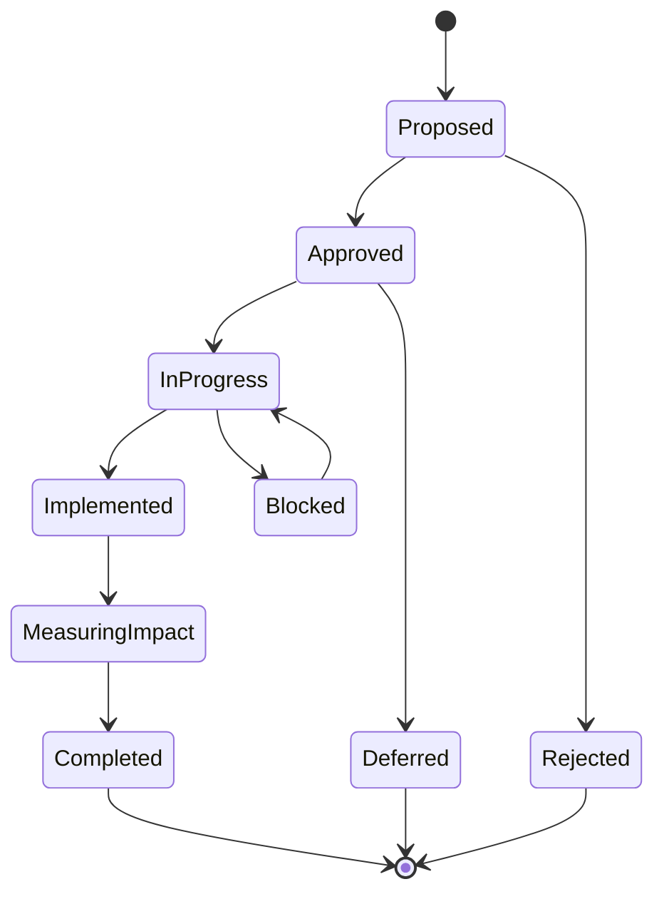
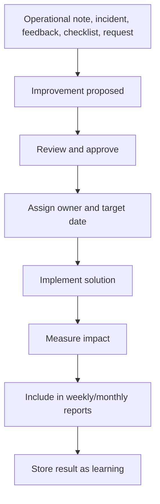

# Service Improvement Module

## Purpose

The Service Improvement module turns operational observations into tracked continuous improvement. It ensures that problems, ideas, and management requests become accountable work with owners, statuses, outcomes, and measured impact.

The module supports a culture of continuous improvement in RIBBAI Front of House operations.

## Improvement Examples

- Service flow improvement
- Communication improvement
- Training improvement
- Inventory process improvement
- Pre-service briefing improvement
- Table pacing improvement
- Guest handoff improvement
- Checklist discipline improvement

## Core Objectives

- Track every improvement from problem to result.
- Link improvements to operational evidence.
- Measure impact where possible.
- Feed weekly and monthly reports.
- Make continuous improvement visible to management.
- Build a historical library of what worked.

## Core Data Structure

```ts
type ServiceImprovement = {
  id: string;
  title: string;
  improvementType: ImprovementType;
  problem: string;
  proposedSolution: string;
  ownerId: string;
  status: ImprovementStatus;
  priority: "low" | "normal" | "high" | "urgent";
  expectedImpact: string;
  measuredImpact?: string;
  resultSummary?: string;
  sourceType: "operational_note" | "incident" | "team_feedback" | "management_request" | "checklist" | "other";
  sourceId?: string;
  targetDate?: string;
  startedAt?: string;
  completedAt?: string;
  reviewedBy?: string;
  createdBy: string;
  createdAt: string;
  updatedAt: string;
};
```

## Improvement Types

| Type | Description |
| --- | --- |
| Service flow | Improves movement, sequence, handoffs, or pacing |
| Communication | Improves briefing, escalation, or team coordination |
| Training | Addresses skill, knowledge, or consistency gaps |
| Inventory process | Improves inventory-related operational discipline |
| Standards | Improves compliance with service or checklist standards |
| Guest experience | Directly improves guest-facing quality |
| Management process | Improves decision, escalation, or reporting flow |
| Other | Used only when no category fits |

## Status Lifecycle



## Status Definitions

| Status | Meaning |
| --- | --- |
| Proposed | Idea captured but not approved |
| Approved | Accepted for implementation |
| In progress | Work has started |
| Implemented | Solution has been applied operationally |
| Measuring impact | Waiting to assess result |
| Completed | Result has been reviewed and closed |
| Blocked | Cannot proceed without support |
| Deferred | Valid but postponed |
| Rejected | Not accepted |

## Required Fields

Every improvement must track:

- Problem
- Proposed solution
- Owner
- Status
- Expected result
- Result
- Measured impact

Recommended additional fields:

- Priority
- Source record
- Target date
- Review date
- Management support needed
- Linked action plan item
- Linked report IDs

## Workflow



## Impact Measurement

Impact can be quantitative or qualitative.

### Quantitative Impact Examples

- Reduced overtime hours.
- Improved checklist completion rate.
- Reduced repeated incidents.
- Improved punctuality.
- Reduced service bottleneck notes.
- Reduced inventory variance or process errors.

### Qualitative Impact Examples

- Better communication during service.
- Improved confidence after training.
- Faster handoff between team members.
- Better guest flow.
- Reduced friction in pre-service setup.

## Impact Fields

```ts
type ImprovementImpact = {
  baselineMetric?: number;
  resultMetric?: number;
  metricUnit?: string;
  qualitativeResult?: string;
  impactRating: "none" | "low" | "medium" | "high";
  measuredAt: string;
  measuredBy: string;
};
```

## Report Integration

### Weekly Report

Use improvements for:

- Solutions implemented
- Service improvements
- Action plan
- Risks for next week
- Executive summary wins

Weekly display should show:

- New improvements opened
- Improvements completed
- Improvements blocked
- Measured impact where available

### Monthly Report

Use improvements for:

- Service improvement trends
- Operational excellence
- KPI evolution
- Recommendations
- Management actions

Monthly display should show:

- Improvement funnel
- Completion rate
- Average time to implement
- Repeated problems reduced
- Highest-impact improvements

## Ownership Rules

- Every improvement must have one accountable owner.
- Improvements can have collaborators but only one owner.
- Blocked improvements must identify what support is needed.
- Management-owned actions should be converted to management requests or management actions.

## Relationship to Operational Notes

Operational notes capture what happened. Service improvements capture what will change.

Example:

- Operational note: "Communication between floor and pass was slow during peak dinner service."
- Service improvement: "Introduce a two-minute pre-peak alignment briefing before dinner rush."
- Measured impact: "Fewer repeated clarifications during peak; team feedback improved."

## Relationship to Management Requests

If an improvement needs approval, budget, staffing, or a management decision, it should create or link to a management request.

Example:

- Improvement: "Train one additional runner for Saturday dinner coverage."
- Management request: "Approve additional training hours for selected team member."

## Relationship to Action Plans

Approved improvements should generate action plan items when work is required.

Action plan item examples:

- Draft new briefing checklist.
- Test new table handoff process for one week.
- Review results with Luís and Paulo.

## KPIs

- Improvements opened
- Improvements approved
- Improvements completed
- Improvements blocked
- Completion rate
- Average implementation time
- Measured impact coverage
- High-impact improvement count
- Repeated issue reduction

## Quality Rules

- Do not create improvements without a clear problem.
- Do not close improvements without a result.
- Do not mark impact as measured without evidence.
- Keep improvement titles short and operational.
- Link improvements to source evidence whenever possible.

## Future AI Use

The improvement history can support future AI by learning:

- Which solutions work for recurring problems.
- Which categories create the most value.
- Which unresolved issues tend to become incidents.
- Which training needs repeat.
- Which management actions unblock performance fastest.

AI should suggest improvements, but Filipe or management should approve them before they enter the workflow.
