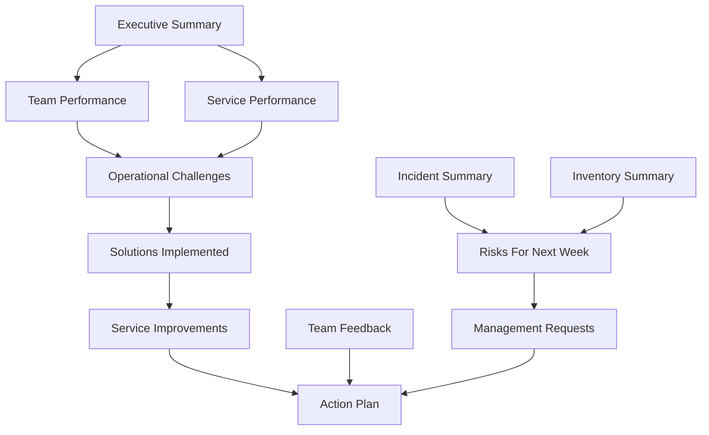

# Weekly Operations Report Specification

## Purpose

The Weekly Operations Report is the primary accountability document for RIBBAI Front of House operations. It summarizes the week, explains what happened operationally, identifies risks, documents improvements, and gives Luís, Paulo, and Francisco a clear management-level view of service performance.

This report is not an inventory report. Inventory appears only as one operational signal.

## Audience

- Luís
- Paulo
- Francisco

## Ownership and Schedule

- Primary author: Filipe Catalão
- Submission cadence: weekly
- Weekly inventory input: every Tuesday
- Report period: configurable week window, recommended Monday through Sunday
- Submission target: first management review after period close

## Report Design Principles

- Executive first: start with decisions, risks, and operational meaning.
- Evidence based: every claim should link to data or an approved note.
- Action oriented: every unresolved issue should map to an action, owner, or management request.
- Balanced: include achievements and improvements, not only problems.
- Operational: center Front of House service, people, standards, and accountability.

## Required Report Metadata

| Field | Type | Required | Description |
| --- | --- | --- | --- |
| reportId | string | Yes | Unique report identifier |
| reportType | enum | Yes | `WEEKLY_OPERATIONS` |
| restaurant | string | Yes | RIBBAI |
| periodStart | date | Yes | Start of reporting week |
| periodEnd | date | Yes | End of reporting week |
| weekNumber | number | Yes | Calendar week |
| preparedBy | user reference | Yes | Filipe Catalão |
| submittedTo | user list | Yes | Luís, Paulo, Francisco |
| status | enum | Yes | Draft, submitted, acknowledged, revised |
| submittedAt | datetime | No | Submission timestamp |
| approvedSnapshotVersion | number | Yes | Version of frozen report data |

## Section 1: Executive Summary

### Purpose

Give management a fast understanding of the week: performance, risks, wins, and required decisions.

### Data Sources

- KPI engine
- Operational notes
- Incidents
- Service improvements
- Management requests
- Team feedback
- Attendance and overtime summaries

### Data Structure

```ts
type WeeklyExecutiveSummary = {
  overallStatus: "excellent" | "stable" | "watch" | "at_risk";
  headline: string;
  keyWins: string[];
  keyConcerns: string[];
  decisionsRequired: string[];
  nextWeekFocus: string[];
};
```

### Required Fields

- Overall status
- One-paragraph headline
- Top 3 wins
- Top 3 concerns
- Management decisions required
- Top priorities for next week

### Display Format

- One-page opening section.
- KPI strip at top.
- Short narrative paragraph.
- Three columns: Wins, Concerns, Decisions Required.

### KPI Calculations

- Overall operations score = weighted score from attendance, service quality, checklist compliance, incidents, and completed action plan items.
- Risk count = unresolved medium/high/critical risks for next week.
- Decision count = open management requests requiring Luís, Paulo, or Francisco.

## Section 2: Team Performance

### Purpose

Measure whether staffing, attendance, and workload supported the FOH operation effectively.

### Data Sources

- Shifts
- Attendance
- Overtime
- Employee records
- Operational notes

### Data Structure

```ts
type TeamPerformanceSummary = {
  scheduledHours: number;
  workedHours: number;
  overtimeHours: number;
  attendanceRate: number;
  punctualityRate: number;
  absenceCount: number;
  lateClockInCount: number;
  staffingNotes: string[];
};
```

### Required Fields

- Scheduled hours
- Worked hours
- Overtime hours
- Overtime percentage
- Attendance percentage
- Punctuality percentage
- Absences
- Late arrivals
- Notes on staffing pressure

### Display Format

- KPI cards for scheduled hours, worked hours, overtime, attendance.
- Trend comparison against previous week when available.
- Employee-level exception table for absence, lateness, or overtime.

### KPI Calculations

- Scheduled hours = sum of planned shift duration minus planned breaks.
- Worked hours = sum of actual clock-out minus clock-in minus actual breaks.
- Overtime hours = max(worked hours - scheduled hours, 0), aggregated.
- Overtime percentage = overtime hours / scheduled hours x 100.
- Attendance rate = present shifts / scheduled shifts x 100.
- Punctuality rate = on-time clock-ins / expected clock-ins x 100.

## Section 3: Service Performance

### Purpose

Evaluate service standards, team coordination, communication, and operational efficiency.

### Data Sources

- Operational notes
- Checklists
- Incidents
- Team feedback
- Service improvements
- Manager review inputs

### Data Structure

```ts
type ServicePerformance = {
  serviceQualityScore: number;
  teamCoordinationScore: number;
  communicationScore: number;
  operationalEfficiencyScore: number;
  evidence: ServiceEvidence[];
};
```

### Required Fields

- Service quality rating
- Team coordination rating
- Communication rating
- Operational efficiency rating
- Supporting notes
- Positive examples
- Areas needing attention

### Display Format

- Four KPI cards using 1-5 or 0-100 scoring.
- Short narrative for each dimension.
- Evidence list linking back to notes, incidents, checklist results, or improvements.

### KPI Calculations

- Service quality score = weighted average of completed service standards, positive notes, incident severity, and management review.
- Team coordination score = briefing completion, handoff quality, team feedback, and incident correlation.
- Communication score = pre-service briefing completion, issue escalation speed, and feedback sentiment.
- Operational efficiency score = checklist completion, service bottleneck notes, overtime pressure, and incident volume.

## Section 4: Operational Challenges

### Purpose

Make challenges visible, structured, and accountable.

### Data Sources

- Operational notes
- Incidents
- Team feedback
- Attendance exceptions
- Checklist failures
- Inventory constraints

### Data Structure

```ts
type OperationalChallenge = {
  title: string;
  category: string;
  severity: "low" | "medium" | "high" | "critical";
  description: string;
  impact: string;
  rootCause?: string;
  linkedSources: string[];
};
```

### Required Fields

- Challenge title
- Category
- Severity
- Description
- Operational impact
- Root cause if known
- Linked evidence

### Display Format

- Prioritized table ordered by severity.
- Each high or critical challenge includes mitigation status.

### KPI Calculations

- Challenge count by severity.
- Repeat challenge count = challenges with same category/root cause from previous reports.
- High-impact challenge ratio = high/critical challenges / total challenges.

## Section 5: Solutions Implemented

### Purpose

Show management what was done during the week to resolve operational problems.

### Data Sources

- Service improvements
- Action plans
- Incidents
- Operational notes
- Checklist corrective actions

### Data Structure

```ts
type ImplementedSolution = {
  problem: string;
  solution: string;
  ownerId: string;
  implementedAt: string;
  resultSummary: string;
  measuredImpact?: string;
};
```

### Required Fields

- Problem addressed
- Solution implemented
- Owner
- Implementation date
- Result
- Measured or observed impact

### Display Format

- Before/after cards.
- Table for all implemented solutions.
- Highlight top 1-3 meaningful improvements.

### KPI Calculations

- Solution implementation rate = implemented solutions / planned solutions.
- Average time to implement = implementation date - creation date.
- Impact score = improvement impact rating averaged across completed improvements.

## Section 6: Service Improvements

### Purpose

Track continuous improvement, not only issue resolution.

### Data Sources

- Service improvement module
- Operational notes
- Team feedback
- Management requests

### Data Structure

```ts
type ServiceImprovementReportItem = {
  improvementType: "service_flow" | "communication" | "training" | "inventory_process" | "standards" | "other";
  problem: string;
  proposedSolution: string;
  status: string;
  ownerId: string;
  expectedImpact: string;
  measuredImpact?: string;
};
```

### Required Fields

- Improvement type
- Problem
- Proposed solution
- Owner
- Status
- Expected impact
- Measured impact when available

### Display Format

- Active improvements table.
- Completed improvements section.
- Impact notes for completed items.

### KPI Calculations

- Active improvement count.
- Completed improvement count.
- Improvement completion rate = completed / opened within period.
- Measured impact coverage = improvements with measured impact / completed improvements.

## Section 7: Team Feedback

### Purpose

Capture team sentiment, recurring friction, ideas, and training needs.

### Data Sources

- Team feedback module
- Operational notes
- Service improvement proposals

### Data Structure

```ts
type TeamFeedbackSummary = {
  themes: FeedbackTheme[];
  positiveFeedback: string[];
  concerns: string[];
  trainingNeeds: string[];
};
```

### Required Fields

- Feedback theme
- Feedback type: positive, concern, suggestion, training need
- Source anonymity flag
- Operational category
- Management relevance

### Display Format

- Theme summary.
- Positive signals.
- Concerns and proposed follow-up.
- Training needs list.

### KPI Calculations

- Feedback volume by category.
- Repeated theme count.
- Training need count.
- Positive-to-concern ratio.

## Section 8: Incident Summary

### Purpose

Summarize incidents without turning the report into an incident log.

### Data Sources

- Incident records
- Corrective actions
- Operational notes
- Documents where relevant

### Data Structure

```ts
type WeeklyIncidentSummary = {
  totalIncidents: number;
  incidentsBySeverity: Record<string, number>;
  incidentsByType: Record<string, number>;
  unresolvedIncidents: IncidentSummaryItem[];
  correctiveActions: string[];
};
```

### Required Fields

- Total incidents
- Severity breakdown
- Type breakdown
- Unresolved incident count
- Corrective actions
- Escalations

### Display Format

- Small incident KPI row.
- Severity table.
- Narrative only for high or critical incidents.

### KPI Calculations

- Incident rate = incidents / service days.
- Critical incident count.
- Resolution rate = resolved incidents / total incidents.
- Average resolution time = resolved date - reported date.

## Section 9: Inventory Summary

### Purpose

Provide operational context from inventory without making inventory the center of the report.

### Data Sources

- Inventory items
- Inventory transactions
- Weekly inventory
- Weekly inventory items
- Operational notes

### Data Structure

```ts
type InventoryOperationsSummary = {
  weeklyInventoryDate: string;
  totalVarianceValue?: number;
  criticalStockIssues: string[];
  serviceImpactNotes: string[];
  processIssues: string[];
};
```

### Required Fields

- Weekly inventory date, expected Tuesday
- Major stock variances
- Items affecting service
- Wastage or process issues
- Required management attention

### Display Format

- Short supporting section.
- Exception-only table.
- No full inventory listing in weekly operations report.

### KPI Calculations

- Inventory variance value = actual inventory value - expected inventory value.
- Critical stock issue count.
- Service-impacting inventory issue count.
- Weekly inventory completion status.

## Section 10: Risks For Next Week

### Purpose

Show what could affect the next operational week before it happens.

### Data Sources

- Operational challenges
- Incidents
- Attendance and overtime
- Checklists
- Inventory exceptions
- Management requests
- Team feedback

### Data Structure

```ts
type NextWeekRisk = {
  risk: string;
  likelihood: "low" | "medium" | "high";
  impact: "low" | "medium" | "high" | "critical";
  mitigation: string;
  ownerId: string;
};
```

### Required Fields

- Risk description
- Likelihood
- Impact
- Mitigation
- Owner
- Management support needed

### Display Format

- Risk matrix.
- Top risks list.
- Mitigation table.

### KPI Calculations

- Risk score = likelihood score x impact score.
- High risk count.
- Risk carryover count from previous week.

## Section 11: Management Requests

### Purpose

Make requests to Luís, Paulo, and Francisco explicit and trackable.

### Data Sources

- Management request module
- Operational notes
- Service improvement module
- Risks
- Action plan

### Data Structure

```ts
type ManagementRequest = {
  title: string;
  requestedBy: string;
  requestedTo: string[];
  reason: string;
  decisionNeeded: string;
  priority: "low" | "normal" | "high" | "urgent";
  dueDate?: string;
};
```

### Required Fields

- Request title
- Requester
- Requested decision maker
- Reason
- Decision needed
- Priority
- Due date
- Status

### Display Format

- Decision request block.
- Table of open requests.
- Highlight urgent requests.

### KPI Calculations

- Open management requests.
- Urgent requests.
- Average days open.
- Acknowledgement rate.

## Section 12: Action Plan

### Purpose

Translate report findings into accountable next steps.

### Data Sources

- Service improvements
- Operational challenges
- Risks
- Incidents
- Management requests
- Team feedback

### Data Structure

```ts
type WeeklyActionPlanItem = {
  action: string;
  ownerId: string;
  dueDate: string;
  priority: "low" | "normal" | "high" | "urgent";
  expectedOutcome: string;
  status: "not_started" | "in_progress" | "completed" | "blocked" | "deferred";
};
```

### Required Fields

- Action
- Owner
- Due date
- Priority
- Expected outcome
- Linked source
- Status

### Display Format

- Action plan table.
- Separate blocked items section.
- Carryover items from previous week.

### KPI Calculations

- Action completion rate = completed actions / total actions.
- Blocked action count.
- Overdue action count.
- Carryover action count.

## Report Approval and Snapshot Rules

- Weekly report data should be snapshotted at submission.
- Edits after submission should create a new version.
- Management comments should not overwrite the original report.
- Report should record acknowledgement by Luís, Paulo, and Francisco when relevant.
- Any management request should remain open until explicitly resolved or deferred.

## Weekly Report Output Structure


