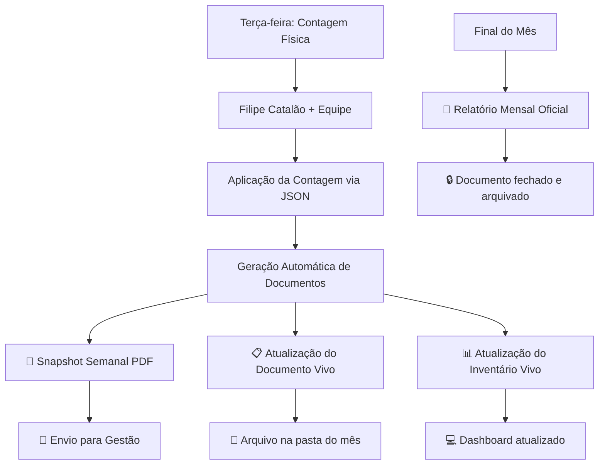

# Sistema de Monitorização Contínua de Consumíveis RIBBAI
## Julho 2026 em diante

**Data de implementação:** ${new Date().toLocaleDateString("pt-PT")}  
**Status:** 🟢 **Ativo - Arquitetura Implementada**

---

## 📋 Visão Geral

A partir de Julho 2026, o RIBBAI opera um **Sistema de Monitorização Contínua** de consumíveis que substitui o modelo mensal isolado por uma abordagem **viva e integrada**. 

O sistema mantém **100% da identidade visual** do template oficial de Junho 2026 mas introduz três tipos distintos de documentos, cada um com propósito específico.

---

## 🎯 Os Três Tipos de Relatórios

### 📊 1. Inventário Vivo
**Estado atual do sistema em tempo real**

| Aspecto | Descrição |
|---------|-----------|
| **Propósito** | Consulta operacional do estado atual |
| **Audience** | Equipe operacional, supervisores |
| **Frequência** | Contínuo (sempre atualizado) |
| **Acesso** | Dashboard RIBBAI, consultas ad-hoc |
| **Formato** | Interface web, queries diretas |

**Quando usar:**
- Verificar stock atual de um item específico
- Consultar status de reposição
- Planeamento de compras imediatas
- Resolução de operações diárias

---

### 📑 2. Relatório Mensal
**Análise completa e oficial do mês**

| Aspecto | Descrição |
|---------|-----------|
| **Propósito** | Análise financeira e operacional completa |
| **Audience** | Gestão, Administração, Auditoria |
| **Frequência** | Final de cada mês (documento oficial) |
| **Acesso** | PDF oficial, arquivo permanente |
| **Formato** | PDF com dados fechados do mês |

**Características:**
- ✅ **Dados fechados** (não muda após publicação)
- ✅ **Validação completa** de continuidade
- ✅ **Análise financeira** detalhada (CMP, gastos totais)
- ✅ **Comparação mês-a-mês** consolidada
- ✅ **Aprovação formal** antes da publicação

**Quando usar:**
- Relatórios executivos mensais
- Análises financeiras oficiais
- Auditorias e compliance
- Documentação histórica

---

### 📸 3. Snapshot Semanal
**Estado semanal para decisões de gestão**

| Aspecto | Descrição |
|---------|-----------|
| **Propósito** | Decisões de reposição e alertas críticos |
| **Audience** | Gestão, Administração |
| **Frequência** | Todas as terças-feiras (automático) |
| **Acesso** | PDF enviado via email/partilhado |
| **Formato** | PDF profissional com dados da semana |

**Características:**
- ✅ **Dados da contagem semanal** (Terças-feiras)
- ✅ **Recomendações de encomenda** específicas
- ✅ **Estado crítico** actualizado
- ✅ **Evolução semana-a-semana**
- ✅ **Pronto para Gestão** (formato executivo)

**Quando usar:**
- Reuniões de gestão semanais
- Decisões de compra urgentes
- Monitorização de ruturas críticas
- Comunicação com fornecedores

---

## 🔄 Fluxo Operacional Semanal



---

## 📂 Estrutura de Arquivos

### Localização dos Documentos

```
docs/operational-records/2026/07-Julho/Relatorio-Mensal-Consumiveis/
├── 📋 documento-mensal-vivo-julho.html          # Documento Vivo (sempre atualizado)
├── 📑 relatorio-mensal-oficial-07-2026.pdf     # Relatório Oficial (final do mês)
├── 
├── 📁 Snapshots-Semanais/                      # Snapshots para Gestão
│   ├── 2026-07-08-snapshot-consumiveis.pdf    # Semana 1
│   ├── 2026-07-15-snapshot-consumiveis.pdf    # Semana 2  
│   ├── 2026-07-22-snapshot-consumiveis.pdf    # Semana 3
│   └── 2026-07-29-snapshot-consumiveis.pdf    # Semana 4
├── 
├── 📁 Inventory-Count-Sheets/                  # Folhas de contagem físicas
├── 📁 Exports-PDF/                            # PDFs gerados (backup)
└── 📁 Logs-Auditoria/                         # Validações e logs
```

---

## 🛠️ Como Usar - Comandos npm

### Geração de Snapshots Semanais
```bash
# Snapshot semanal individual
npm run snapshots:weekly -- --year=2026 --month=7 --date=2026-07-08

# Processo completo semanal (recomendado)
npm run snapshots:weekly:with-update -- --date=2026-07-08 --json=path/to/weekly-count.json
```

### Documento Vivo
```bash
# Atualizar documento mensal vivo
npm run reports:consumables:live -- --year=2026 --month=7
```

### Relatório Mensal Oficial
```bash
# Relatório oficial (final do mês)
npm run reports:consumables:monthly -- --year=2026 --month=7

# Preview durante o mês
npm run reports:consumables:monthly -- --year=2026 --month=7 --preview
```

### Validações
```bash
# Validar continuidade Junho → Julho
npm run validation:inventory:continuity
```

---

## 📊 Comparação Detalhada

| Aspecto | Inventário Vivo | Relatório Mensal | Snapshot Semanal |
|---------|----------------|------------------|------------------|
| **Dados** | Tempo real | Fechados (mês completo) | Ponto no tempo (semana) |
| **Formato** | Web/Interface | PDF oficial | PDF executivo |
| **Frequência** | Contínuo | Mensal | Semanal |
| **Mutável** | ✅ Sempre atual | ❌ Imutável após publicação | ❌ Imutável (snapshot) |
| **Audience** | Operacional | Gestão/Admin/Auditoria | Gestão/Admin |
| **Propósito** | Operações diárias | Análise oficial | Decisões semanais |
| **Template Visual** | Dashboard | 🎨 **Template Junho** | 🎨 **Template Junho** |
| **Validações** | Básicas | Completas + Auditoria | Médias |
| **Arquivo** | Não arquivado | Arquivo permanente | Arquivo mensal |

---

## 🎨 Identidade Visual

**IMPORTANTE:** Todos os documentos **PDF** (Relatório Mensal + Snapshots Semanais) preservam **100%** da identidade visual do template oficial de Junho 2026:

### Elementos Preservados
- ✅ **Paleta de cores:** #172033, #f4f6fb, #d8deea
- ✅ **Tipografia:** Arial, sans-serif 
- ✅ **KPI Cards:** Layout 4x2, cores #f8fafc
- ✅ **Badges:** Verde/Vermelho para status
- ✅ **Barras:** Categoria e saúde do stock
- ✅ **Tabelas:** Estrutura e formatação
- ✅ **Layout:** Panels arredondados, espaçamentos
- ✅ **Footer:** RIBBAI OPS branding

### Diferenças de Conteúdo (mantendo visual)
- **Snapshot Semanal:** Info da semana, evolução, recomendações
- **Documento Vivo:** Indicador "vivo", evolução acumulativa

---

## ⚙️ Automação e Integração

### Processo Automático (Terças-feiras)

1. **Input:** Contagem física → JSON
2. **Processamento:** `run-weekly-inventory-update-with-snapshot.mjs`
3. **Outputs:**
   - 📊 Base de dados atualizada
   - 📸 Snapshot semanal PDF
   - 📋 Documento vivo atualizado
   - 📈 Relatórios standard atualizados

### Validações Automáticas

- ✅ **Continuidade de stock** (mês anterior → atual)
- ✅ **Consistência de itens** (SKUs, unidades, preços)  
- ✅ **Transição de críticos** (recuperados vs novos)
- ✅ **Integridade de dados** (CMP, transações)

---

## 🚨 Alertas e Notificações

### Snapshot Semanal
- 🔴 **Itens críticos** - Lista para encomenda imediata
- 🟡 **Novos críticos** - Items que deterioraram esta semana
- 🟢 **Recuperados** - Items que saíram do estado crítico
- 📊 **Evolução** - Tendências semana-a-semana

### Documento Vivo
- 📈 **Evolução acumulativa** - Soma de todas as semanas
- 🔄 **Última atualização** - Timestamp da última contagem
- 📋 **Estado atual** - Baseado na última contagem física

---

## 🔒 Governação e Compliance

### Hierarquia de Autoridade
1. **Relatório Mensal Oficial** - Autoridade máxima (imutável)
2. **Snapshots Semanais** - Autoridade semanal (enviados à Gestão)
3. **Documento Vivo** - Referência operacional (mutável)
4. **Inventário Vivo** - Consulta operacional (tempo real)

### Auditoria
- 📋 Todos os documentos têm **timestamps** e **referências**
- 🔍 **Logs de auditoria** em `Logs-Auditoria/`
- ✅ **Validações obrigatórias** antes de cada geração
- 📁 **Arquivo permanente** de todos os snapshots e relatórios

---

## 🎯 Objetivos Alcançados

### ✅ Continuidade Garantida
- Stock de Junho = Stock inicial de Julho (validado automaticamente)
- Sem resets mensais - evolução contínua
- Preservação de CMP e preços unitários

### ✅ Automação Completa  
- Snapshots semanais automáticos (Terças-feiras)
- Documento vivo sempre atualizado
- Validações e alertas automáticos

### ✅ Identidade Visual Preservada
- 100% fidelidade ao template de Junho
- Consistência visual em todos os documentos
- Profissionalismo mantido

### ✅ Diferenciação Clara
- Cada tipo de documento tem propósito específico
- Audiences bem definidas 
- Fluxos de trabalho otimizados

---

## 📞 Contactos e Responsabilidades

| Responsabilidade | Contacto |
|------------------|----------|
| **Contagem Física** | Filipe Catalão (Terças-feiras) |
| **Aplicação de Dados** | Equipe Técnica RIBBAI |
| **Snapshots para Gestão** | Sistema Automático |
| **Validações** | Sistema Automático + Auditoria |
| **Suporte Técnico** | Equipe de Desenvolvimento RIBBAI |

---

*Documentação técnica da Arquitetura de Monitorização Contínua*  
*RIBBAI Operations Management Platform*  
*Implementado: Julho 2026*